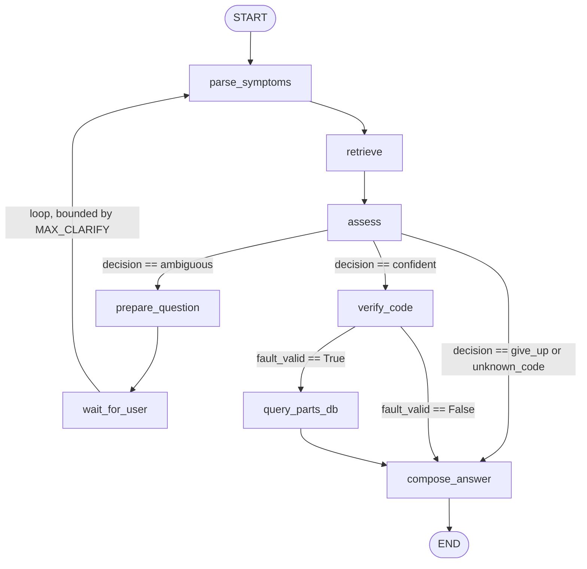

## Phase 4: LLM-Phrased Answers with a Guardrail

### Design
qwen2.5:3b, served via a local Ollama container (docker-compose profile
`local-llm`), phrases only the final answer for the "confident" decision
path (a verified fault + optional parts). The clarifying-question and
unknown-code/give_up paths stay on the deterministic template — lower
value to naturalize, and less surface area for fabrication in an
already-uncertain state.

The LLM is given only facts already retrieved and DB-verified (fault
cause/action, parts_result) and instructed to rephrase, not add.
Every generated response is checked with allowed_parts()/
part_numbers_in() (render.py, written in Phase 3 but unused until now)
before being trusted: if the LLM mentions any part number not actually
in parts_result, the generated text is discarded entirely and
render_answer()'s deterministic template is used instead. Any Ollama
call failure (timeout, connection error) also falls back silently —
the agent must keep working even if the LLM is unavailable.

### Verified: success path
`fault 5081` with --llm produced a naturally phrased, accurate action
list, correctly keeping all part numbers/prices exact (MK-FAN-1001,
MK-FAN-1002, MK-OLD-0001 — all genuinely present in parts_result).

### Verified: guardrail catch
Constructed a synthetic state with a fabricated part number
(MK-PREMIUM-9999) embedded in the fault's action text. The LLM
repeated it in its phrased output; the guardrail detected the mismatch
against allowed_parts() and discarded the generation, falling back to
the template, with the trip logged:
    [llm_render] guardrail tripped, invented part(s) {'MK-PREMIUM-9999'}, falling back
Confirms the safety net functions on a real detection, not just in
theory.

### Scope note on the guardrail
The guardrail checks the LLM's *generated* text against allowed parts;
it does not scrub bad data already present in a fault's cause/action
field. In this synthetic test the fake part number was planted directly
into the input text to force a realistic detection scenario. In
production, fault text originates from EventIndex.parse_event() off
the manual itself, so this specific injection vector doesn't arise —
but the guardrail's actual job is narrowly "the LLM may not add
information," not "all upstream data is validated."

### Fidelity gap noticed (not a guardrail failure)
On the fault-5081 success case, the LLM's phrasing presented
MK-FAN-1002 and MK-OLD-0001 as fallback options without carrying over
their out-of-stock status from parts_result. No invented facts (no
guardrail trip), but a loss of nuance from the source data — a
faithfulness gap, not a fabrication. This is exactly what Ragas'
faithfulness metric (planned for Phase 6) is designed to catch
systematically; noted here as an example found by inspection before
that tooling is in place.

### Cold start
First Ollama call after container start took 33.2s (model load into
memory). Subsequent calls are fast. Not addressed with pre-warming yet
— worth a --warm-llm CLI flag or a startup ping if this becomes a
demo-reliability issue.

### Known gap in render_answer's contract
render_answer() assumes a fully-populated fault dict (kind, code, name,
page, cause, action) with no schema validation — a caller missing a
field gets a raw KeyError rather than a clear error. Not a live risk
(the only real caller, EventIndex, always populates it fully), but
worth flagging since llm_render.py's fallback path is now a second
caller with the same implicit contract.

# Phase 4: Agentic Layer (LangGraph)

## Overview

Built the agent graph per the original roadmap's design:

    parse_symptoms → retrieve → assess → (verify_code | prepare_question | compose_answer)

with a bounded human-in-the-loop clarification cycle, a read-only parameterized
mock parts database, and an optional LLM-phrasing layer with a hard
fact-guardrail. This phase also absorbed two real bug fixes surfaced and
closed out during Phase 3/4 hardening (query accumulation across
clarification turns; wasted reranking on already-resolved exact codes),
since both live in `agent/nodes.py`.

---

## Graph structure



### Conditional edge 1 — `route_after_assess` (three-way branch out of `assess`)

- **`"confident"` → `verify_code`.** Fires when either `parse_symptoms` found
  an exact code match (`state["exact"]` set), or `collapse(candidates)`'s top
  pick cleared `MIN_GAP_RATIO` and `MIN_TOP_SCORE`.
- **`"ambiguous"` → `prepare_question`.** Fires when there are candidates but
  none confidently separates from the runner-up, and `clarify_count <
  MAX_CLARIFY`. Loops back into the clarification cycle.
- **everything else (`"give_up"`, `"unknown_code"`) → `compose_answer`
  directly**, skipping verification and DB lookup — there's no fault object
  to verify or query parts for.

### Conditional edge 2 — `route_after_verify` (two-way branch out of `verify_code`)

- **`fault_valid == True` → `query_parts_db`.** `verify_code` checks
  `FAULT_RE.match(code)` and a non-empty `action` field — a sanity check that
  the "fault" the graph is about to act on is actually well-formed parsed
  output, not corrupted data.
- **`fault_valid == False` → `compose_answer` directly**, skipping the parts
  lookup, routing to the `"unverified"` decision text.

### The loop

`wait_for_user → parse_symptoms` is the only back-edge in the graph, and it
is bounded by `MAX_CLARIFY = 2` inside `assess`'s own logic — **not** by the
graph structure itself. The graph's shape alone does not guarantee
termination; termination is a property of `assess`'s `clarify_count` check,
which is state logic, not graph wiring. Worth being able to explain this
distinction directly if asked "how do you know this doesn't loop forever."

---

## Item-by-item status

### 1. `db/tools.py` review — Done

Verified against the roadmap's three asks:

- **Read-only:** yes. `sqlite3.connect(f"file:{DB_PATH}?mode=ro", uri=True)`
  enforces this at the SQLite driver level, not just as app convention — a
  real protection, not a naming convention.
- **Parameterized (SQL-injection safety):** yes. Every query uses `?`
  placeholders (`WHERE part_number = ?`, `WHERE fp.fault_code = ?`), never
  string interpolation.
- **Schema:** built `parts` / `inventory` / `warehouses` / `fault_parts`
  (roadmap named the fourth table `compatibility` generically; `fault_parts`
  is the same mapping-table idea, named for what it actually maps — a
  deliberate, defensible naming choice, not a gap).
- **`FAULT_RE` soundness:** `^[0-9A-F]{4}$` matches the actual 4-character
  hex code format used throughout. `parts_for_fault` calls
  `.strip().upper()` before checking, so lowercase input is normalized
  first — sound as used.

No code changes made; confirmed correct as built.

---

### 2. `event_index.py` duplicate-code bug — Documented, not fixed

**Revised finding** (corrects an earlier, less precise version of this note):
`EventIndex.by_code` is keyed by code alone, not `(kind, code)`. The parsed
manual has code `64B1` appearing **twice as two distinct same-kind faults**
— "Internal SSW fault" and "Fault reset" — not a fault/warning collision as
first assumed. The existing tiebreak logic only resolves fault-vs-warning
collisions:

```python
if ev["kind"] == "fault" and prev["kind"] != "fault":
    self.by_code[ev["code"]] = ev     # prefer the fault
```

Two same-kind duplicates fall through this check entirely — whichever comes
second in chunk order silently overwrites the first in `by_code`, making one
of the two faults **permanently unreachable** via `get_event("64B1")` or any
exact-code CLI lookup. It is tracked in `self.collisions`, but nothing
surfaces this as an actual problem anywhere downstream.

**Decision: document, do not fix**, given project timeline. The correct fix
would key `by_code`/`by_chunk_id` lookups by `(kind, code)` and have
`parse_symptoms` thread through the `kind` hint it already parses via
`CONTEXT_CODE` (currently captured, then discarded — only the numeric code
group is kept) so a user typing "warning 64B1" vs. "fault 64B1" could
resolve to the correct one.

---

### 3. Mid-clarification topic-switch behavior — Decided, documented

After the `retrieve()` fix (using only the latest turn rather than the full
accumulated `user_turns` history — see Known Fixes below), a new edge case
follows directly: if a user is mid-clarification and replies with something
unrelated to the original ambiguous question, `retrieve()` searches fresh on
that unrelated text, `assess` finds no good match against it, and the agent
silently re-asks a **new** clarifying question. The original ambiguous fault
question is dropped without being resurfaced, and `clarify_count` still
increments toward `MAX_CLARIFY` on the unrelated tangent.

**Decision: document as known limitation, do not fix.** Reliably
distinguishing "an answer to my question" from "an unrelated topic change"
requires real intent classification, which is out of scope for this
project's timeline. Flagged as a candidate improvement for a future
iteration (e.g., a lightweight classifier or heuristic gate before treating
a reply as a fresh query).

---

### 4. Emergency-stop / how-to false-accept — Reproduced live, documented

**Repro** (fresh, isolated CLI session, single turn):

```
symptom> how do I wire the emergency stop

Warning AFE1: Emergency stop (off2) (manual page 418)
Cause: Drive has received an emergency stop (mode selection off2) command.
What to do: Check that it is safe to continue operation. Then return
emergency stop push button to normal position. Restart drive. If the
emergency stop was unintentional, check the source selected by parameter
21.05 Emergency stop source.

No replacement part is mapped to this code in the parts database.

[retrieval ms: dense_ms=296, bm25_ms=1, fuse_ms=0, rerank_ms=1622]
```

**Root cause.** "How do I wire the emergency stop" is an
installation/how-to question, not a symptom report — but the query and
AFE1's chunk text share strong lexical/semantic overlap ("emergency stop"),
so dense, BM25, and the reranker all score it highly. This is a different
class of error from the Phase 2 hard negatives (wrong fault among competing
candidates): it is a **category error** — the query doesn't describe an
observed symptom at all, and nothing in the pipeline currently distinguishes
symptom-report intent from how-to/informational intent.
`MIN_GAP_RATIO`/`MIN_TOP_SCORE` don't catch it because the top score is
genuinely high with no close second candidate — this is exactly the
`oos_accept` failure mode `tune_thresholds.py`'s grid search is designed to
penalize, but the current `out_of_scope` eval bucket only contains
off-topic and near-domain-but-unrelated examples, not on-topic-but-wrong-intent
how-to questions.

**Decision: document as known limitation, not fixed**, given timeline.
Candidate fixes, not attempted:
  a. Add how-to-phrased `out_of_scope` eval examples and let threshold
     tuning push `MIN_TOP_SCORE` up to reject them (risk: may trade off
     real symptom coverage — untested).
  b. A lightweight intent classifier ahead of retrieval (symptom report vs.
     how-to/informational question), routing how-to queries to a different,
     non-committal response.
  c. Cheap query-pattern heuristics (`"how do I"`, `"how to"`, `"what does
     X mean"`) as a pre-filter before trusting a confident retrieval match.

---

### 5. Graph diagram + conditional-edge writeup — Done

See "Graph structure" section above.

---

### 6. LLM-answer path tested live — Done

`llm_render.py` phrases the final answer via local `qwen2.5:3b` (Ollama) for
the `"confident"` decision path only, with a hard guardrail: any generated
text mentioning a part number not present in `allowed_parts(parts_result)`
is discarded entirely, falling back to the deterministic `render_answer()`
template. Any Ollama call failure also falls back silently.

**Verified: success path.** `fault 5081` with `--llm` produced a naturally
phrased, accurate action list, correctly preserving all real part
numbers/prices (`MK-FAN-1001`, `MK-FAN-1002`, `MK-OLD-0001`).

**Verified: guardrail catch.** A synthetic state with a fabricated part
number (`MK-PREMIUM-9999`) embedded in the fault's action text was fed
directly to `llm_phrase_answer`. The LLM repeated the fabricated number in
its output; the guardrail detected the mismatch against `allowed_parts()`
and discarded the generation, falling back to the template, with the trip
logged:

```
[llm_render] guardrail tripped, invented part(s) {'MK-PREMIUM-9999'}, falling back
```

**Scope note on the guardrail.** It checks the LLM's *generated* text
against allowed parts; it does not scrub bad data already present in a
fault's own cause/action field. In production, fault text originates from
`EventIndex.parse_event()` off the real manual, so this specific injection
vector doesn't arise there — but the guardrail's actual job is narrowly "the
LLM may not add information," not "all upstream data is validated."

**Fidelity gap noticed (not a guardrail failure).** On the fault-5081
success case, the LLM's phrasing presented `MK-FAN-1002` and `MK-OLD-0001`
as fallback options without carrying over their out-of-stock status from
`parts_result`. No invented facts (no guardrail trip), but a loss of nuance
— a faithfulness gap, not a fabrication. This is exactly what Ragas'
`faithfulness` metric (Phase 6) is designed to catch systematically; noted
here as an example found by inspection before that tooling was run.

**Cold start.** First Ollama call after container start took 33.2s (model
load into memory). Subsequent calls are fast. Not addressed with
pre-warming — worth a `--warm-llm` flag or startup ping if this becomes a
demo-reliability concern.

---

## Known fixes made during Phase 4 hardening

### Fixed: query accumulation in the clarification loop

`AgentState.user_turns` uses `operator.add`, so every clarification reply is
appended to, not replacing, the running text. `retrieve()` originally joined
the *full* `user_turns` history into one query string, so the original
symptom description permanently outweighed later corrections. Fixed by
having `retrieve()` use only the latest turn for search, while
`parse_symptoms` still scans the full history for a typed code (a user may
state a code in a later turn after an initial free-text description).

**Verified fix**, same symptom sequence:

Before fix — second turn barely moved the candidate list:
```
auxiliary fan is broken   → fault 5081, warning A582, warning A581
the drive is overheating  → fault 5081, warning A582, fault 4210   (fan codes still dominant)
```

After fix — second turn fully replaces the prior context:
```
auxiliary fan is broken   → fault 5081, warning A582, warning A581
the drive is overheating  → fault 4210, warning A4A1, fault 4290
```

### Fixed: wasted rerank on already-resolved exact codes

`retrieve()` was unconditionally calling `search_events()` even when
`parse_symptoms` had already resolved an exact or typed-but-unknown code,
paying full dense+BM25+rerank cost (3.3–4.3s observed) for a result
`assess()` immediately discarded. Fixed with an early-return guard:

```python
def retrieve(state):
    if state.get("exact") or state.get("typed_code"):
        return {"candidates": []}
    query = state["user_turns"][-1]
    return {"candidates": retriever.search_events(query, k=5)}
```

**Verified**, full CLI loop — `fault 4290` resolved with
`dense_ms=0, bm25_ms=0, fuse_ms=0, rerank_ms=0`, confirming search was fully
bypassed.

### Fixed: stale retrieval-timing display on the exact-code path

`retriever.last_timing` is only written inside `search_events()`. When
`retrieve()` short-circuits for an exact/typed code, it never calls
`search_events()`, so the CLI's timing line displayed the *previous* turn's
real search timing instead of reflecting that no search ran. Fixed by
explicitly zeroing `last_timing` on the short-circuit path. Purely
cosmetic — did not affect correctness or actual latency — but worth fixing
since a stale number claiming rerank re-ran would have been misleading in a
demo or report.

---

## Phase 4: status

All six tracked items closed, three of them (2, 3, 4) with genuine,
reproduced findings and deliberate documented decisions rather than silent
gaps. Three real bugs found and fixed during hardening, each with verified
before/after evidence.

**Not done, called out rather than left implicit:**
- 64B1 `(kind, code)` keying fix (item 2)
- Mid-clarification intent/topic-switch detection (item 3)
- Symptom-vs-how-to intent classification (item 4)

All three are reasonable candidates for a "future work" section of the final
report — each has a concrete, specific proposed fix direction already
written down, not just "this could be better."
